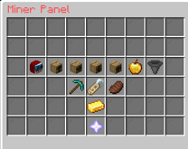

# 🎒 Backpack

**Small Ender Backpack**

.png>)

**Small Brown Backpack**

.png>)

**Strange Backpack**

.png>)

**Wood Backpack**

**Stone Backpack**

.png>)

**Redstone Backpack**

.png>)

**Minerals Backpack**

.png>)
