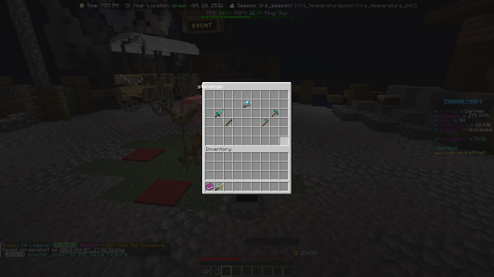
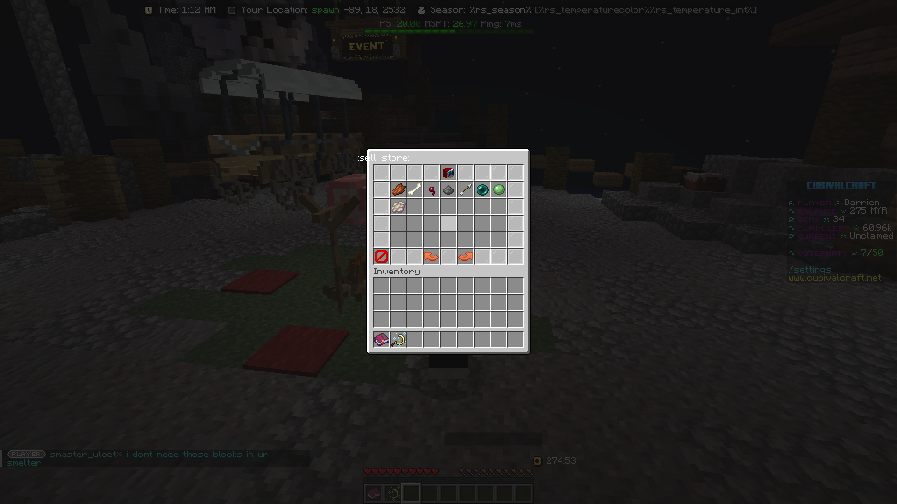
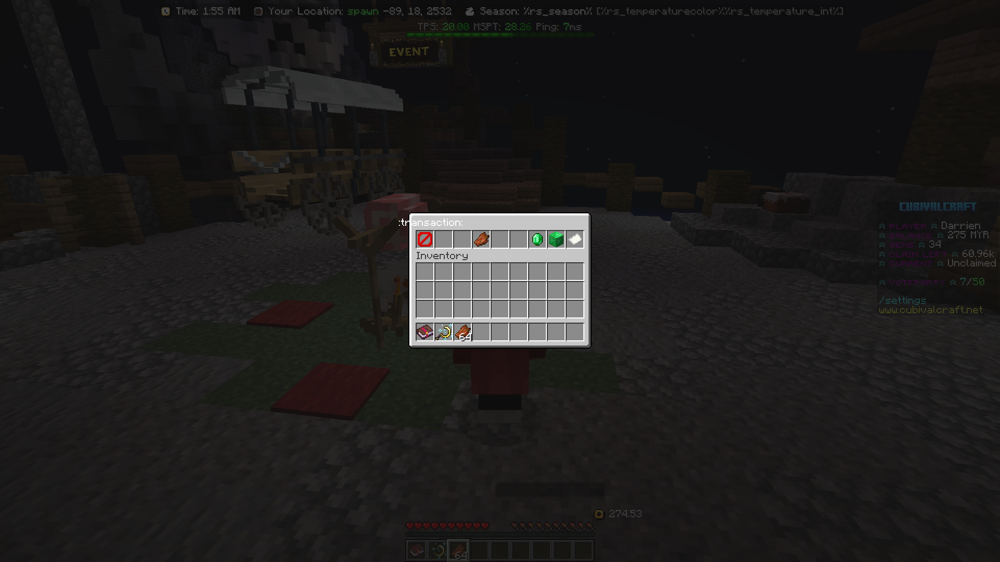
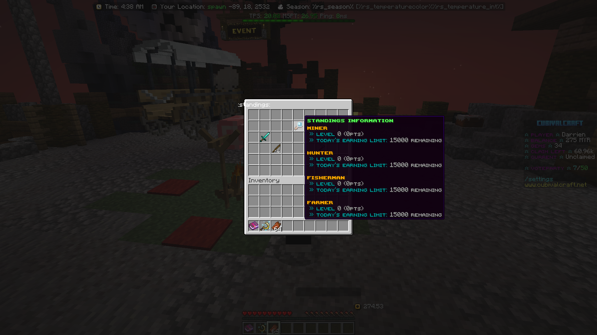

# Commission

What is Commission? How does it work?

* Commission is a plugin created by **BlueFakAlert**. It allows players to complete tasks, earn points, and exchange them for the items they want.

> Let us explain how it works in a simple way!

#### We currently offer 4 different commissions for players to choose from. You don't need to join a specific commission to complete tasks.

1. To access the commission menu, use the command `/standings.`
2. You will see a menu.
3. In the menu, we have _**Hunter, Miner, Fisherman, and Farmer.**_
4. For example, if you want to do a **Hunter task**, press the **Diamond Sword (Hunter).**
5. Your screen should then display this menu&#x20;
6. Find the "Tasks" button (Book and Quill).
7. In the Tasks menu, you can start selling the items you have. There is a daily limit of 15,000 points.


**Please remember that each task has their own pts (points)**


<figure><figcaption>
2) You will see a menu
</figcaption></figure>

<figure><figcaption>
For example, if you want to do a <strong>Hunter task</strong>, press the <strong>Diamond Sword (Hunter).</strong>
</figcaption></figure>

<figure><figcaption></figcaption></figure>

* Emerald: <mark style="color:blue;">**Sell 1**</mark>
* Emerald Block: <mark style="color:purple;">**Sell 64**</mark>
* Paper: <mark style="color:orange;">**Sell All**</mark>

<figure><figcaption></figcaption></figure>


**Standings Information**


<figure><figcaption></figcaption></figure>
