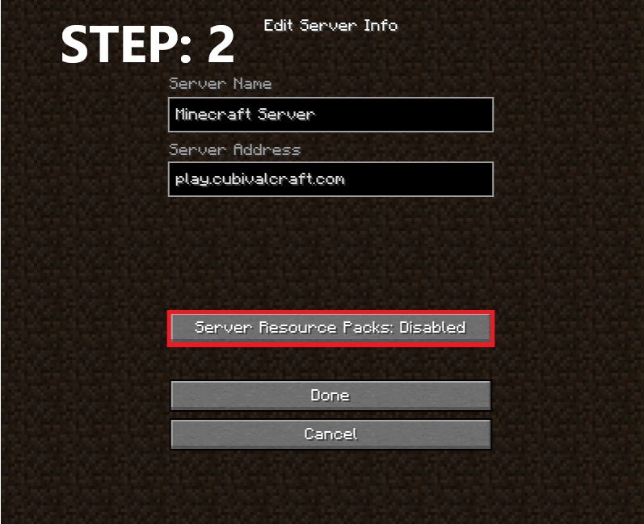

# 🔴 How to Disable

&#x20;[<mark style="color:red;">**Optifine**</mark> ](https://optifine.net/downloads)<mark style="color:red;">**is no longer required. But it's still recommended to install for better gaming experience!**</mark>


How to Disable server resources pack?


 (1) (1).png>)

.png>)
